

# 脉冲波形的变换与产生

## 单稳态触发器

&emsp;&emsp;暂稳态的持续时间仅取与RC参数值有关。

- &emsp;&emsp;输出脉冲宽度：$t_w≈0.7RC$ 
- &emsp;&emsp;恢复时间：$t_{re} ≈ 3 \tau d $
- &emsp;&emsp;最高工作频率：$f_{max} = \frac{1}{T_{min}}  = \frac{1}{t_w + t_{re}}$

> 可重复触发
> 不可重复触发

不可重复触发的集成单稳态触发器 `74121`

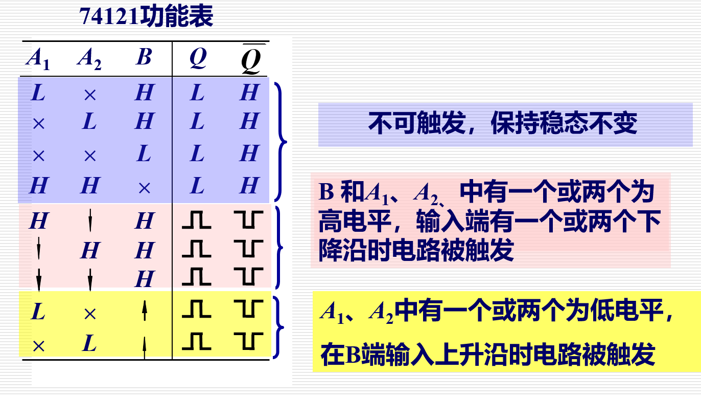

### 应用

####  定时
&emsp;&emsp;可用于频率计
#### 延时

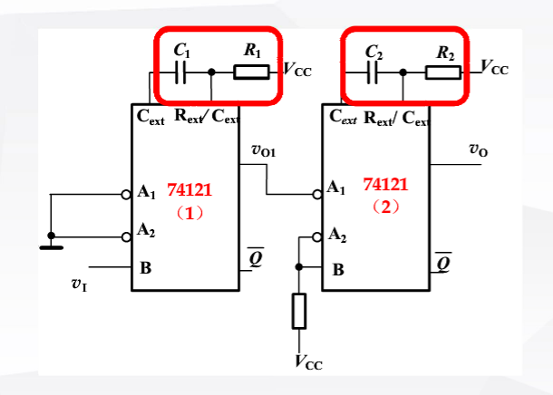

延时时间：&emsp; $t_{w1} = 0.7R_1C_1$
输出脉宽：&emsp; $t_{w2} = 0.7R_2C_2$

#### 消除噪声

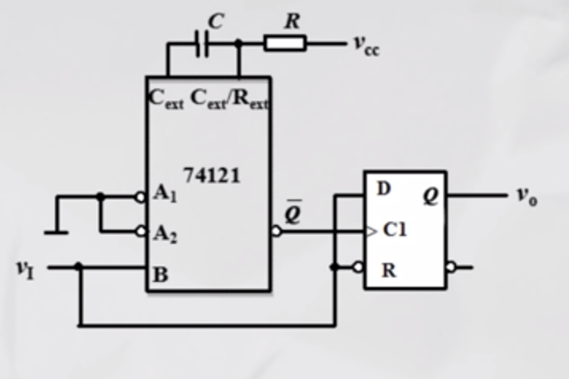
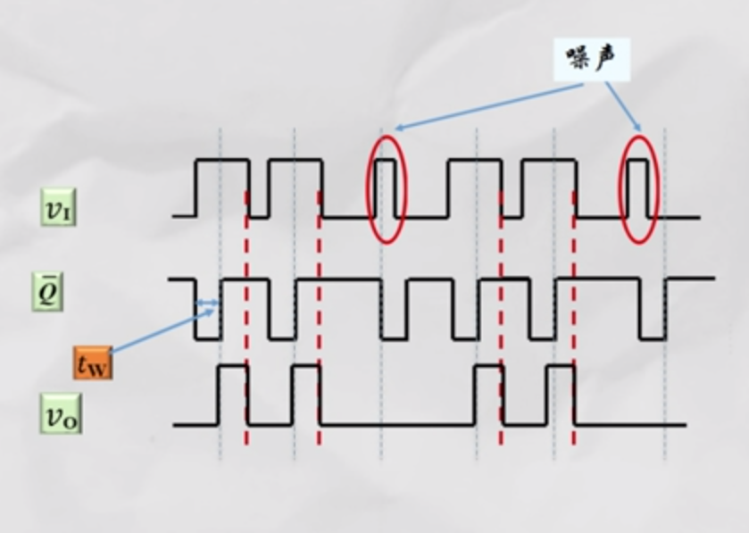

$噪声脉冲宽度<单稳态触发器的暂稳态脉冲宽度<信号脉冲宽度$  

## 施密特触发器

$正向阈值电压:  V_{T+}$
$负向阈值电压:  V_{T-}$

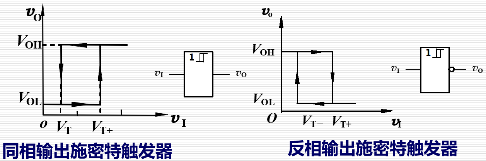

#### 应用

1.  波形变换 
2.  波形的整形
3.  消除干扰信号
4.  幅度鉴别 

## 多谐振荡器

#### 由CMOS门电路组成的多谐振荡器:

&emsp;&emsp;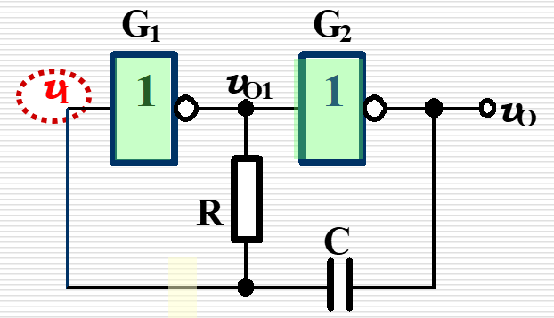
&emsp;&emsp;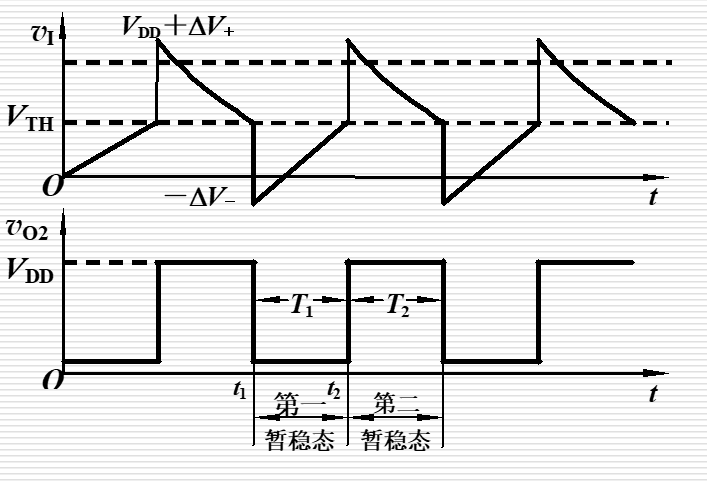

&emsp;&emsp;振荡周期： $ T＝RC1n4≈1.4RC $ 

#### 用施密特触发器构成波形产生电路:

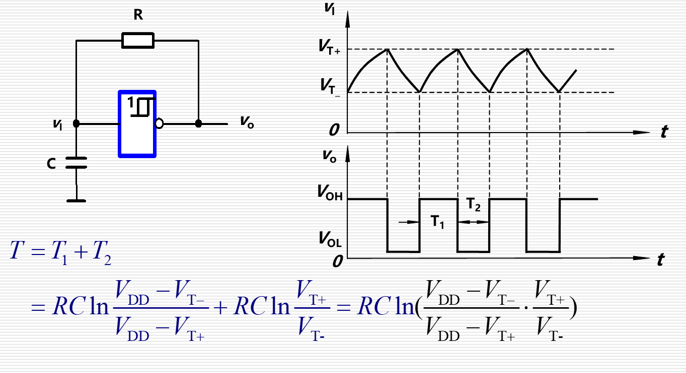

## 555定时器

#### 电路组成与功能表

&emsp;&emsp;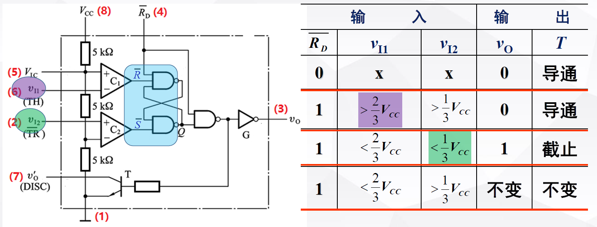

#### 组成施密特触发电路

&emsp;&emsp;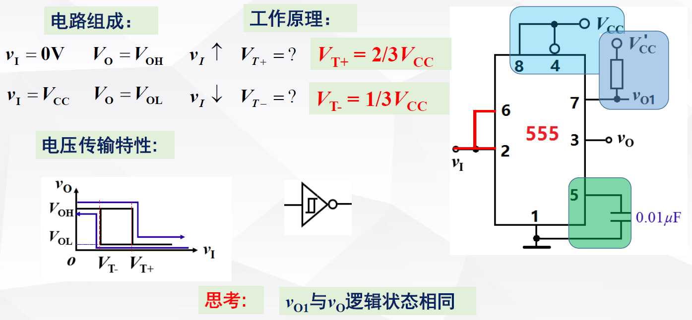

#### 组成单稳态触发电路

&emsp;&emsp;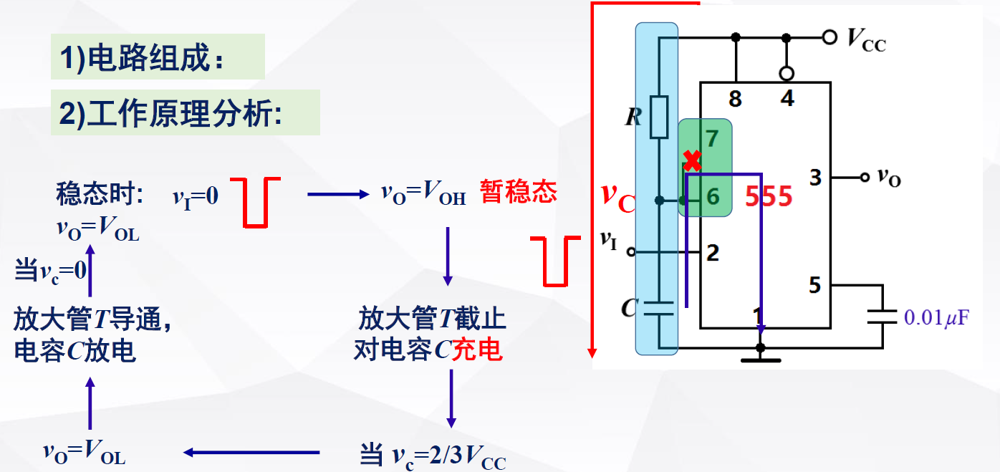

 

- &emsp;&emsp;不可重复触发
- &emsp;&emsp;$t_w=RC1n3≈1.1RC $
- &emsp;&emsp;触发脉冲宽度不能大于 $t_w$ 

&emsp;&emsp;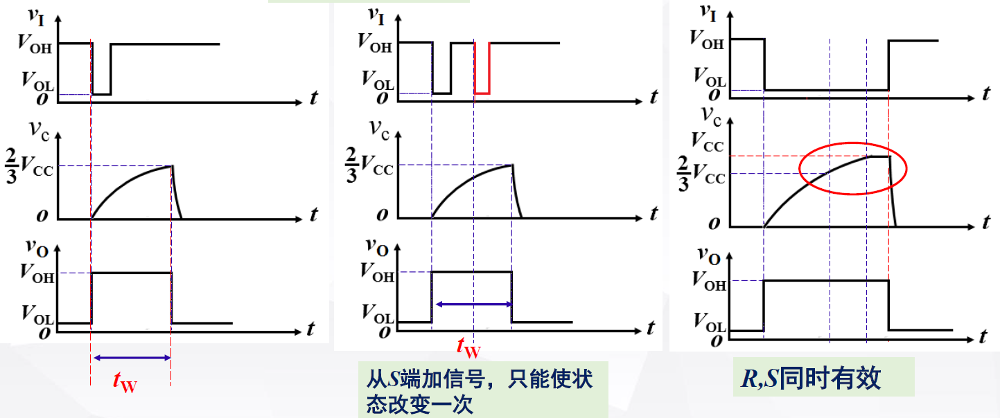

#### 组成多谐振荡器

&emsp;&emsp;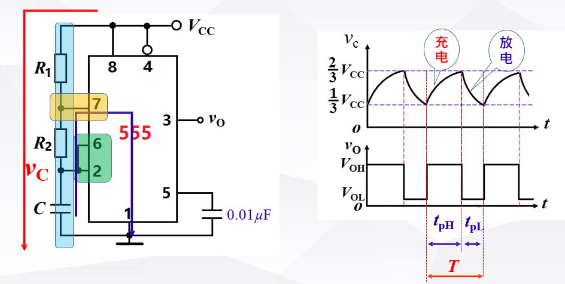

 

- &emsp;&emsp; $t_{pH}	= (R_1 + R_2 )C ln2 ≈ 0.7(R_1 + R_2 )C$
- &emsp;&emsp; $t_{pL}	= R_2 C ln2 ≈ 0.7 R_2 C$
- &emsp;&emsp; $T	= (R_1 + 2R_2 )C ln2 ≈ 0.7(R_1 + 2R_2 )C$

