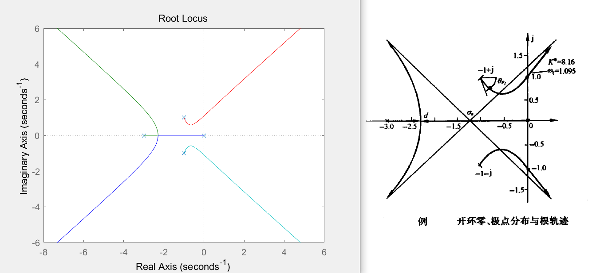

## 实例2：根轨迹绘制

> 根轨迹绘制的一般步骤：
> 1. 确定实轴上的根轨迹
> 2. 确定根轨迹的渐近线
> 3. 确定分离点
> 4. 确定起始角与终止角
> 5. 确定根轨迹与虚轴的交点

&emsp;&emsp;设系统开环传递函数为：
$$G(s)H(s) = \frac{K^*}{s(s+3)(s^2+2s+2)}$$
试绘制闭环系统的概略根轨迹。

&emsp;&emsp;**解：** 极点：`0` `-3` `-1+j` `-1-j`
&emsp;&emsp;按下述步骤绘制根轨迹：  
&emsp;&emsp;**1）确定实轴上的根轨迹。** 实轴上 [0,-3] 为根轨迹。  
&emsp;&emsp;**2）确定根轨迹的渐近线。** 由 $n-m=4$ 可知，有4条渐近线，其：
$$\sigma_a = \frac{\sum_{i=1}^{4}p_i-0}{4} = \frac{(0-3-1+j-1-j)-0}{4} = -1.25$$

$$\phi_a = \frac{(2k+1)\pi}{4} = \frac{\pi}{4} , \frac{3\pi}{4} ,\frac{5\pi}{4} , \frac{7\pi}{4}  $$

&emsp;&emsp;**3）确定分离点。** 本题没有有限零点，因此

$$\sum_{i=1}^n\frac{1}{d-p_i} = 0$$

&emsp;&emsp;即

$$\frac{1}{d} + \frac{1}{d+3} + \frac{1}{d+1-j} + \frac{1}{d+1+j} = 0$$

&emsp;&emsp;解得：$d = -2.2886$ 。

&emsp;&emsp;**4）确定起始角（本题无终止角）。** 

&emsp;&emsp;$s =-1+j$ 时：  
&emsp;&emsp;$\theta_1 = \angle(-1+j-0) = \angle(-1+j) = 2.3562$  
&emsp;&emsp;$\theta_2 = \angle(-1+j+3) = \angle(2+j) = 0.4636$   
&emsp;&emsp;$\theta_3 = \angle(-1+j+1+j) = \angle(2j) = 1.5708$   

&emsp;&emsp;由相角条件：$0 - (\theta_0+\theta_1+\theta_2+\theta_3) = (2k+1)\pi$
&emsp;&emsp;得：$\theta_0 = (-2k-1-(2.3562+0.4636+1.5708)/\pi)\pi = (-2k-2.3976)\pi = -0.3976\pi = -71.5680^\circ (k=-1)$  

&emsp;&emsp;**5）确定根轨迹与虚轴的交点。** 本题闭环特征方程式为
$$s^4 + 5 s^3 + 8 s^2 + 6 s + K^* = 0$$
&emsp;&emsp;令 $s = j\omega$ ，则
$$(j\omega)^4 + 5 (j\omega)^3 + 8 (j\omega)^2 + 6 (j\omega) + K^* = 0$$
&emsp;&emsp;即
$$(\omega^4-8\omega^2+K^*) + j(-5\omega^3+6\omega) = 0$$
&emsp;&emsp;解得
$$\omega = 0,\pm1.0954$$
&emsp;&emsp;其中$\omega=0$不是欲求之解，将$\omega = \pm1.0954$ 代入实部方程，解得 $K^* = 8.1594$ 。

&emsp;&emsp;因此整个系统根轨迹如图：

