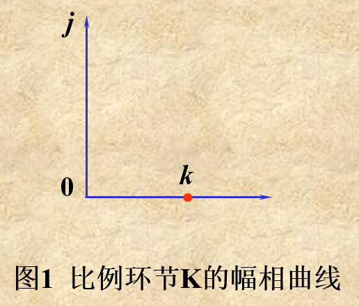
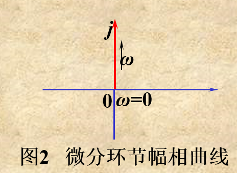
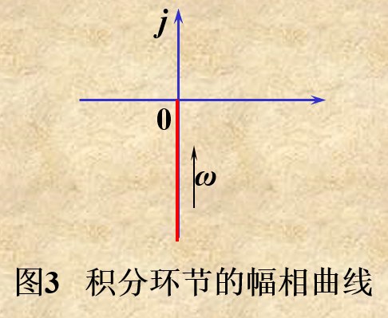
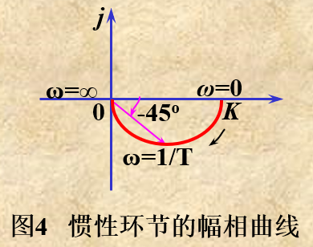
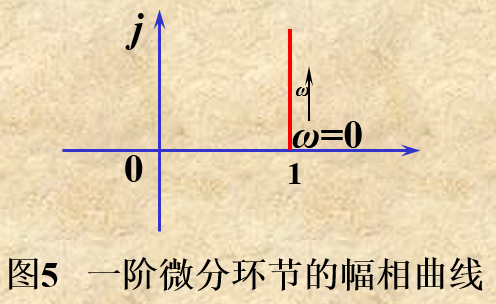

 

## 幅相频率特性（Nyquist图）

### 比例环节

$~~~~~~~~G(s) = K~~~~~~~~~~~~~~~~~~~~G(j\omega) = K$

$~~~~~~~~|G| = K~~~~~~~~~~~~~~~~~~~~~~\angle G = 0^\circ$

&emsp;&emsp; 

### 微分环节

$~~~~~~~~G(s) = s~~~~~~~~~~~~~~~~~~~~G(j\omega) = j\omega$

$~~~~~~~~|G| = \omega~~~~~~~~~~~~~~~~~~~~~~\angle G = 90^\circ$

&emsp;&emsp; 

### 积分环节

$~~~~~~~~G(s) = \frac{1}{s}~~~~~~~~~~~~~~~~~~~~G(j\omega) = \frac{1}{j\omega}$

$~~~~~~~~|G| = \frac{1}{\omega}~~~~~~~~~~~~~~~~~~~~~~\angle G = -90^\circ$

&emsp;&emsp; 

### 惯性环节

$~~~~~~~~G(s) = \frac{1}{Ts+1}~~~~~~~~~~~~~~G(j\omega) = \frac{1}{j\omega T+1}$

$~~~~~~~~|G| = \frac{1}{\sqrt{1+\omega^2T^2}}~~~~~~~~~~~~\angle G = -arctan~\omega T$

&emsp;&emsp; 

### 一阶微分环节 

$~~~~~~~~G(s) = Ts+1~~~~~~~~~~~G(j\omega) = j\omega T+1$

$~~~~~~~~|G| = \sqrt{1+\omega^2T^2}~~~~~~\angle G = arctan~\omega T$

&emsp;&emsp; 

### 振荡环节 

